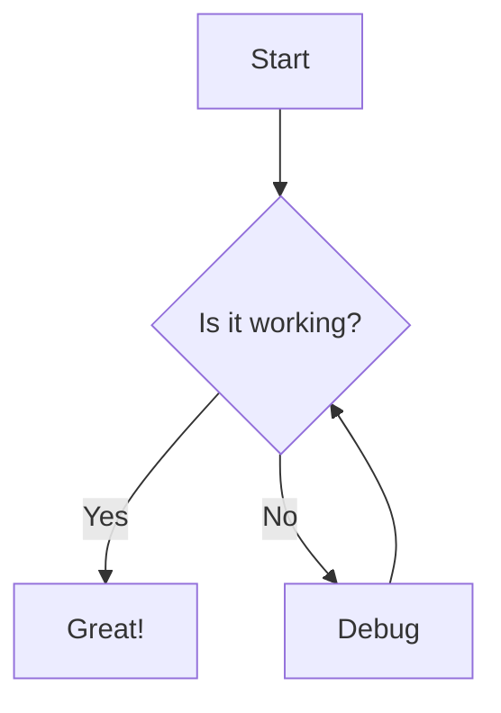

# Markdown syntax

MarkReader renders pages with [marked](https://marked.js.org), a fast and flexible Markdown parser. The engine is extended with popular plugins that are useful for technical documentation.

## Supported extensions

- **GitHub Flavored Markdown** — tables, task lists, strikethrough, autolinks
- **Syntax highlighting** — powered by [highlight.js](https://highlightjs.org/)
- **Math expressions** — powered by [KaTeX](https://katex.org/)
- **Diagrams** — powered by [Mermaid](https://mermaid.js.org/)
- **Emoji** — `:shortcode:` support
- **Alerts** — GitHub-style callouts
- **Footnotes** — numbered references
- **Heading IDs** — automatic anchors for every heading

## Syntax highlight

Code blocks are highlighted automatically. You can specify a language after the opening backticks.

```typescript
function greet(name: string): string {
  return `Hello, ${name}!`;
}
```

## Math

Inline math uses single dollar signs, block math uses double dollar signs.

Inline: $E = mc^2$

Block:

$$
\int_{a}^{b} f(x) \, dx = F(b) - F(a)
$$

## Mermaid diagrams

Use a fenced code block with the `mermaid` language.



## Emoji

You can use common emoji shortcodes:

:rocket: :warning: :bulb: :tada:

## Alerts

GitHub-style alerts are rendered as styled callouts.

> [!NOTE]
> This is a note callout.

> [!TIP]
> This is a tip callout.

> [!IMPORTANT]
> This is an important callout.

> [!WARNING]
> This is a warning callout.

> [!CAUTION]
> This is a caution callout.

## Footnotes

You can add footnotes to your content.[^1]

[^1]: This is the footnote text.

## Tables

| Feature     | Supported | Notes                |
|-------------|-----------|----------------------|
| Tables      | Yes       | GFM syntax           |
| Task lists  | Yes       | `- [x]` syntax       |
| Strikethrough | Yes     | `~~text~~` syntax    |
